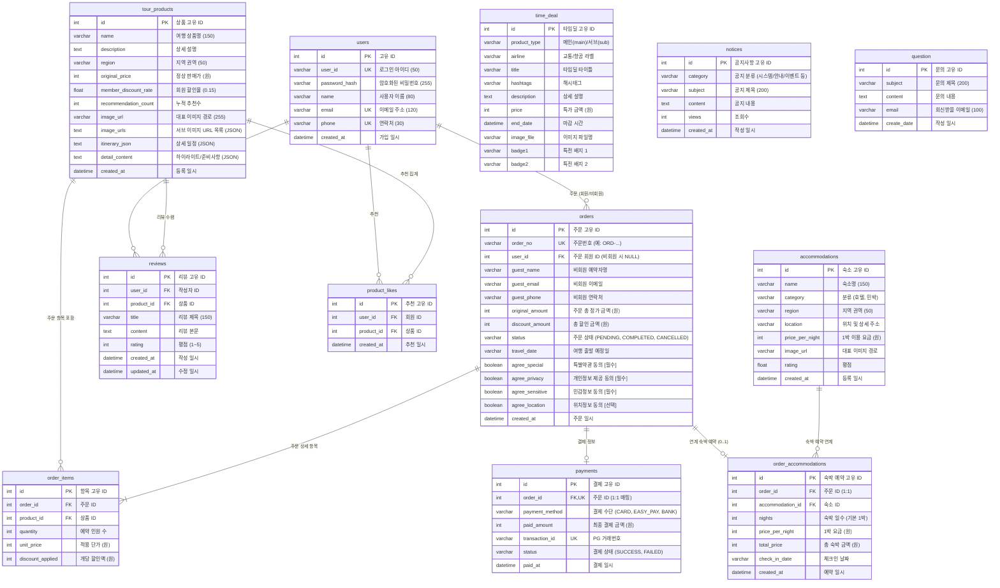

# 🌿 길마중 (Gilmajung Tour)

> **대한민국 구석구석을 잇는 올인원 국내 여행 패키지 예약 & 후기 플랫폼**  
> 6대 권역별 테마 여행 상품 탐색부터 맞춤형 연계 숙박 선택, 간편 전자결제 및 실제 여행객 중심의 리뷰 라이프사이클(작성·수정·삭제) 관리까지 원스톱으로 지원합니다.

---

## 📌 목차
1. [프로젝트 소개](#-프로젝트-소개)
2. [View별 세부 기능 및 화면 구성](#-view별-세부-기능-및-화면-구성)
3. [핵심 특화 시스템 (Seed DB / 다국어 / 지도 인터랙션)](#-핵심-특화-시스템-seed-db--다국어--지도-인터랙션)
4. [사용 기술 및 세부 구현](#-사용-기술-및-세부-구현)
5. [프로젝트 구조](#-프로젝트-구조)
6. [데이터베이스 E-R 다이어그램 (ERD)](#-데이터베이스-e-r-다이어그램-erd)
7. [실행 방법 (DB 초기화 및 Seed 포함)](#-실행-방법-db-초기화-및-seed-포함)
8. [기능 검증 및 시험 완료 항목](#-기능-검증-및-시험-완료-항목)
9. [주의 사항](#-주의-사항)
10. [향후 추가 및 업데이트 가능한 기능](#-향후-추가-및-업데이트-가능한-기능)

---

## 📖 프로젝트 소개

- **프로젝트 이름**: 길마중 (Gilmajung Tour)
- **한 줄 소개**: 수도권·강원·충청·경상·전라·제주 6대 권역별 대화형 여행 상품 추천과 숙박 연계 예약, 전자결제, 헤더 실시간 통합 검색, 그리고 투명한 여행자 후기 시스템을 제공하는 파이썬 플라스크(Flask) 기반 국내 여행 웹 플랫폼입니다.

---

## 🖥 View별 세부 기능 및 화면 구성

본 프로젝트는 Flask 블루프린트(`Blueprint`) 구조에 따라 역할별로 명확히 분리된 View 모듈을 기반으로 동작합니다.

### 1. 메인 포털 & 공통 뷰 (`main_views.py`)
- **메인 포털 화면 (`/`)**:
  - **헤더 통합 검색 (Search Box)**: 상단 GNB의 `searchBoxWrap` 검색창에서 여행지 이름을 입력하고 Enter 키나 돋보기(🔎) 버튼을 누르면 `/product/main_product?kw=검색어`로 즉시 이동하여 일치하는 상품만 필터링 출력
  - **비주얼 배너 슬라이더**: 계절감과 감성을 담은 여행지 풀스크린 배너 및 큐레이션 타이틀 제공
  - **6대 권역 퀵 네비게이션**: 수도권, 강원, 충청, 경상, 전라, 제주 권역으로 즉시 이동 가능한 원형 아이콘
  - **M타임딜 (실시간 카운트다운)**: 마감 시한이 정해진 특가 패키지를 메인 1건, 서브 2건으로 분할 전시하며 남은 시간을 실시간 초 단위로 계산
  - **여행자 후기 반응형 프리뷰 & 비로그인 블러 오버레이**:
    - 최신 등록된 리뷰를 최대 5건까지 반응형 카드 그리드(화면 폭에 따라 1~5열 가변)로 요약 노출
    - **비로그인 사용자 보호 UI**: 비로그인 상태에서는 전체 레이아웃 형태는 유지되되 투명 오버레이 박스 위에 **"User login시에 후기를 확인할 수 있습니다"** 문구가 표시되며, 하단 후기 카드는 블러(`blur`) 처리되어 가독 및 무단 접근 차단
    - **로그인 사용자**: 오버레이가 해제되어 자유롭게 후기 전문 열람 및 상세 이동 가능
  - **공지사항 & 푸터**: 최신 공지사항 3건 노출 (클릭 시 공지사항 페이지의 해당 아코디언이 자동 펼쳐짐) 및 고객센터 안내
- **공지사항 목록 및 상세 화면 (`/notice`)**:
  - **카테고리별 필터 및 검색**: '전체', '시스템', '공모전', '투어안내', '이벤트', '안내' 탭 필터링 및 키워드 검색
  - **페이지 자동 계산 & 아코디언 오픈**: 메인 화면 공지 클릭 시 해당 공지가 속한 페이지(10건 기준)를 자동 계산하여 로딩하고 해당 아코디언 항목을 펼친 상태로 제공
  - **독립 스타일 분리**: `notice.css` 전용 스타일링으로 깔끔하고 가독성 높은 아코디언 인터랙션 제공
- **다국어 세션 설정 (`/set_language`)**:
  - 다국어 언어 변경 요청 시 사용자 세션에 언어 코드를 안전하게 보관 및 동기화

---

### 2. 여행 상품 및 권역 탐색 뷰 (`product_views.py`)
- **권역별 상품 탐색 및 검색 화면 (`/product/main_product`)**:
  - **헤더 검색어 필터링 연동**:
    - 헤더 검색창에서 전달된 키워드(`kw`)를 수신하여 여행지 이름(`TourProduct.name`)에 해당 텍스트가 포함된 상품만 동적 필터링
    - 상단에 `🔍 '{kw}' 검색 결과 (총 N건)` 및 `[검색 초기화]` 버튼 제공
    - 일치하는 여행 상품이 없을 경우 직관적인 빈 결과 안내 메시지 출력
  - **대화형 HTML5 Canvas 권역 지도**:
    - 픽셀 시드 기반 플러드필(Flood Fill) 알고리즘으로 마우스 호버 시 권역 실시간 하이라이트 및 클릭 시 권역 자동 전환
  - **Sticky 지도 레이아웃**:
    - 상품 목록이 길어져 스크롤을 내려도 좌측의 권역 지도와 탭이 화면 상단에 안정적으로 고정 노출 (단, 모바일 화면 제외)
  - **반응형 뷰포트 최적화**:
    - 데스크톱(1025px 이상): 왼쪽 지도(330px) + 오른쪽 2열 상품 그리드
    - 태블릿(769px ~ 1024px): 왼쪽 지도(320px) + 오른쪽 1열 상품 그리드
    - 모바일(768px 이하): 상단 중앙 지도 + 하단 1열 상품 카드 배치
- **상품 상세 및 일정 안내 화면 (`/product/sub_product/<int:product_id>`)**:
  - **멀티 썸네일 스와이퍼(Swiper.js)**: 4장의 고화질 사진 갤러리 및 섬네일 내비게이션
  - **상세 탭 메뉴**: 일정 안내, 상세 일정 타임라인, 지도 보기(Google Maps), 출발 전 정보 탭 전환
  - **상세 일정 타임라인**: 시간대별 집결, 오전 관광, 향토 미식, 오후 문화 체험, 복귀 일정 카드
  - **투어 하이라이트 & 포함/불포함 내역**: 여행 준비사항 및 핵심 포인트 구조화 안내
  - **예약 인원 선택 & 회원 할인 안내**: 회원 15% 기본 할인율 실시간 계산 및 안내
  - **비로그인 사용자 후기 블러 & `review-login-overlay`**:
    - 메인 화면과 동일하게 상품 상세 페이지에서도 비로그인 시 후기 목록이 블러(`blur`) 처리되고 중앙에 **"로그인이 필요한 서비스입니다."** 투명 오버레이 박스 표시
    - 오버레이 클릭 시 현재 페이지 경로(`next=request.full_path`)를 유지하며 로그인 화면으로 안전하게 리다이렉트
  - **추천(좋아요) 상태 연동**: 로그인 회원의 기존 추천 여부에 따라 하트 아이콘(❤️/♡) 동적 렌더링
- **상품 추천(좋아요) 토글 API (`/product/sub_product/like`) [POST]**:
  - **`ProductLike` ORM 연동**: 1인 1회 추천 등록(`liked`) / 취소(`canceled`) 토글
  - **실시간 추천수 반영**: `TourProduct.recommendation_count` 동기화
  - **인증 예외 처리**: 비로그인 시 `401 Unauthorized` 반환 및 프론트엔드 로그인 페이지 이동 컨펌 안내

---

### 3. 주문, 결제 및 내역 조회 뷰 (`order_views.py`)
- **예약 신청 화면 (`/order/reserve`)**:
  - **대표 예약자 정보**: 로그인 회원의 경우 자동 완성, 비회원 예약 시 성명/연락처/이메일 수기 입력
  - **동행 여행객 명단**: 신청 인원수(1~10명)에 맞춰 성명 및 성별을 개별 입력받는 폼 동적 렌더링
  - **4대 약관 동의**: 국내여행 특별약관[필수], 개인정보 제3자 제공[필수], 민감정보 수집이용[필수], 위치기반 서비스[선택]
- **주문 결제 및 연계 숙박 선택 화면 (`/order/payment`)**:
  - **회원 전용 연계 숙박 옵션**: 투어 상품 권역에 해당하는 추천 호텔 및 감성 민박 목록을 확인하고 1박 연계 예약 추가 지원
  - **PortOne V2 전자결제 연동**: 신용카드, 간편결제, 계좌이체 등 모의/실거래 결제창 호출 및 승인
  - **실시간 결제 금액 자동 집계**: 투어 상품가 + 동행 인원 + 숙박 요금을 합산한 최종 결제 금액 산출
- **예약 완료 및 영수증 화면 (`/order/complete`)**:
  - **상단 브랜드 심볼 (`.logo-mark`)**: 기존 체스 기호(`♙`) 대신 길마중 시그니처 4색 브랜드 마크가 상단 헤더에 정돈되어 노출
  - **예약 및 결제 요약 카드**: 고유 주문번호(`ORD-...`), 결제 수단, 최종 결제 금액, 약관 동의 내역 표시
  - **연계 숙박 및 동행자 요약**: 함께 예약된 숙박 시설 정보 및 동행인 명단 정리
  - **인근 추천 관광지 슬라이더**: 같은 권역의 연관 명소를 추가 추천
  - **원클릭 액션 버튼**: 'Review 작성/수정', **'Review 삭제'**, 및 '상세 내역확인하기' 바로가기 제공
- **예약 확인 및 내역 조회 화면 (`/order/lookup`)**:
  - **회원 예약 목록 (아코디언)**:
    - 최신순 예약 목록을 접이식 카드로 표시
    - 헤더 영역에 상태 배지(예약확정/결제대기/취소)와 함께 **'Review 작성'**, 이미 작성된 경우 **'✏️ Review 수정' 및 '🗑️ Review 삭제'** 버튼 노출
    - 삭제 클릭 시 재확인 컨펌 팝업 후 즉시 안전하게 삭제 처리
    - '상세 정보 ▼' 클릭 시 결제 영수증, 동행인, 숙박 정보 및 인근 추천 명소 상세 노출
  - **비회원 단건 예약 조회**: 예약 시 입력한 **예약자 성함**과 **주문번호** 대조를 통해 안전하게 단건 조회
- **예약 취소 API (`/order/cancel/<int:order_id>`) [POST]**:
  - 본인 확인 또는 주문번호 검증 후 주문 상태를 `CANCELLED`로 변경

---

### 4. 여행 후기 커뮤니티 뷰 (`review_views.py`)
- **여행 후기 메인 및 이달의 베스트 후기 (`/review/`)**:
  - 리뷰가 가장 많이 누적된 TOP 3 상품 배너 노출 및 권역별 필터/검색 기능 제공
  - 전체 사용자들의 생생한 여행 후기 목록 탐색
- **상품별 후기 상세 화면 (`/review/detail/<int:product_id>`)**:
  - 해당 투어 상품에 작성된 모든 리뷰의 평점 통계 및 카드 리스트
  - **상태 동적 전환 버튼**: 본인이 작성한 리뷰가 있을 경우 상단 액션 버튼이 `✍️ Review 작성` 대신 **`🗑️ Review 삭제`** (및 `✏️ Review 수정`) 버튼으로 동적 전환
- **후기 작성 화면 (`/review/create/<int:product_id>`)**:
  - **권한 엄격 제어**: 취소되지 않은 실제 예약을 보유한 회원에 한해 자신이 다녀온 상품에만 후기 작성 허용 (비로그인/미구매자 차단)
  - 별점(1~5점) 평가 및 사진/소감 본문 작성
- **후기 수정 화면 (`/review/modify/<int:review_id>`)**:
  - 작성자 본인 인증(`review.user_id == g.user.id`) 후 별점 및 본문 수정 지원
  - 수정 시각(`updated_at` 및 `created_at`)을 최신화하여 최신 후기로 반영
- **후기 삭제 API (`/review/delete/<int:review_id>`) [POST]**:
  - 작성자 본인 확인 후 DB에서 안전하게 영구 삭제
  - 예약 확인 화면(`lookup`), 예약 완료 화면(`complete`), 후기 상세 화면(`review_detail`) 어디서나 원클릭 삭제 가능

---

### 5. 회원 인증 및 계정 관리 뷰 (`auth_views.py`)
- **회원가입 화면 (`/auth/signup`)**:
  - 아이디, 이메일, 연락처 중복 검증 및 비밀번호 암호화 해싱(`pbkdf2:sha256`) 저장
- **로그인 화면 (`/auth/login`)**:
  - 세션 기반 인증 처리 및 로그인 완료 후 이전 작업 페이지 복귀(Safe Next Redirect)
- **로그아웃 (`/auth/logout`)**:
  - 세션 데이터 초기화 후 메인 화면으로 리다이렉트
- **카카오 OAuth 소셜 로그인 (`/auth/kakao`, `/auth/kakao/callback`)**:
  - 카카오 계정 토큰 인증을 통한 간편 로그인 및 회원 연동

---

### 6. 고객센터 뷰 (`customer_views.py`)
- **자주 묻는 질문 FAQ 화면 (`/customer/faq`)**:
  - 예약, 결제, 취소/환불, 일정/코스 등 주요 카테고리별 FAQ 아코디언 제공 및 실시간 키워드 검색
- **1:1 문의 등록 화면 (`/customer/question`)**:
  - 투어 및 예약 관련 개별 문의사항 접수
- **1:1 문의 상세 내역 열람 (`/customer/detail/<int:question_id>`)**:
  - 본인 이메일로 접수된 문의 내역만 열람 가능한 프라이버시 보호

---

## 🌟 핵심 특화 시스템 (Seed DB / 다국어 / 지도 인터랙션)

### 1. 데이터베이스 시딩 시스템 (Seed Database)
본 플랫폼은 개발, 테스트, 데모 시연이 즉시 가능하도록 완벽한 데이터 세트를 제공하는 다중 시딩 아키텍처를 갖추고 있습니다.

- **`seed_database.py` (핵심 기초 데이터)**:
  - **5개 샘플 회원 계정**: `hong`(비밀번호: `12341234`), `traveler_kim`, `jeju_holic`, `tour_master`, `happy_min` 생성 (암호화 해시 적용)
  - **6대 권역 96개 여행 상품**: 권역당 16개씩 총 96개의 풍부한 여행 상품을 정교하게 구축
    - 각 상품별 4장의 고화질 사진 갤러리 URL 매핑
    - 시간대별 일정, 식사, 이동 수단이 구조화된 상세 일정(`itinerary_json`)
    - 핵심 하이라이트 3선, 포함/불포함 내역, 집결지 2곳, 준비사항, 취소환불 규정이 포함된 상세 콘텐츠(`detail_content`)
  - **사전 주문 및 리뷰 데이터 매핑**: `hong` 계정에 18건의 주문 내역과 리뷰 작성 권한을 사전 부여하여 예약 조회, 리뷰 작성/수정/삭제를 즉시 테스트 가능
  - **공지사항 10건**: 시스템, 공모전, 투어안내, 이벤트 등 카테고리별 실감나는 공지 데이터 주입
- **`seed_accommodations_data.py` (연계 숙박 데이터)**:
  - 6대 권역별 20개씩(호텔 10개, 민박 10개) **총 120개 연계 숙박 시설** 구축
  - 숙소명, 카테고리, 1박 요금, 평점, 위치 주소, 이미지 경로 완전 매핑
- **`timedealseed.py` (M타임딜 자동 시딩)**:
  - Flask 앱 시작(`create_app()`) 시 자동으로 실행되어 데이터베이스 내 타임딜 데이터를 점검하고, 메인 특가 1건 및 서브 특가 2건을 실시간 마감 시간(`end_date`)과 함께 동기화

---

### 2. 다국어 자동 번역 및 커스텀 치환 시스템 (`translate.js`)
글로벌 관광객을 위해 Google Translate 위젯과 자체 프론트엔드 치환 엔진을 결합하여 왜곡 없는 고품질 다국어 환경을 구축했습니다.

- **4개 국어 지원**: 한국어(`ko`), 영어(`en`), 일본어(`ja`), 중국어 간체(`zh-CN`)
- **원클릭 즉시 적용 & `googtrans` 쿠키 동기화**:
  - GNB 우측 상단의 언어 선택 드롭다운 클릭 시 새로고침 지연 없이 즉각적으로 대상 언어로 렌더링
  - `googtrans=/ko/{lang}` 쿠키를 동기화하여 페이지를 이동해도 선택된 언어가 영속 유지
- **고유명사 및 브랜드 왜곡 방지 (`translate="no"`, `.notranslate`)**:
  - 길마중 브랜드명, 헤더 심볼, 언어 선택 메뉴, 통화 단위(₩) 등에 `translate="no"` 속성을 적용하여 오번역 차단
- **실시간 커스텀 번역 치환 엔진 (`translationOverrides`)**:
  - 구글 자동 번역 시 웹 레이아웃을 깨뜨리는 장문 번역어(예: **'수도권' ➔ `metropolitan area`**)를 UI에 최적화된 **`metropolitan`** 으로 실시간 강제 치환
  - **TreeWalker & MutationObserver 듀얼 감시**: 구글 번역기가 비동기로 DOM 텍스트 노드를 번역 완료하는 순간을 감지하여 대소문자를 보존한 상태로 즉시 교정
  - **스크립트 캐시 버스팅**: 스크립트 로드 경로에 `?v=...` 파라미터를 적용하여 클라이언트 브라우저 캐시 문제 원천 차단

---

### 3. 지역별/권역별 Canvas 지도 선택 및 반응형 인터랙션 (`main_product.js`)
기존의 단순 텍스트 버튼 나열 방식을 탈피하여, 대한민국 지도 비트맵 그래픽과 HTML5 Canvas 기술을 접목한 인터랙티브 권역 탐색 시스템을 제공합니다.

#### ① HTML5 Canvas 픽셀 플러드필(Flood Fill) 알고리즘
- **알고리즘 개요**:
  - 대한민국 지도 원본 비트맵 이미지(`map_basic.png`, 370 × 539 해상도)의 행정 구역 경계선(어두운 선)을 경계벽으로 삼고, 권역별 내륙 정밀 시드 좌표(`regionSeeds`)로부터 4방향 큐(Queue) 기반 플러드필 탐색을 실행합니다.
  - 이를 통해 370 × 539 크기의 1차원 바이트 배열 `Uint8Array`인 `regionGrid`에 권역 코드(1: 수도권, 2: 강원, 3: 충청, 4: 경상, 5: 전라, 6: 제주)를 1회 사전 색인(O(1) 룩업 테이블)하여 마우스 좌표 판별 성능을 극대화합니다.

- **핵심 함수별 기능 명세**:
  | 함수명 | 입출력 (매개변수 ➔ 반환) | 핵심 기능 및 역할 |
  | :--- | :--- | :--- |
  | `initMapCanvas()` | `void ➔ void` | 캔버스 크기(370×539) 설정, 원본 이미지 렌더링, `getImageData()`로 픽셀 버퍼(`baseImageData`) 추출 및 `buildRegionGrid()`를 호출하여 권역 그리드 캐싱 |
  | `isFillableWhite(data, x, y, width, height)` | `(data, x, y, w, h) ➔ boolean` | 지정 좌표가 채색 가능한 내륙 흰색 픽셀인지 판별 (`alpha > 150 && R > 220 && G > 220 && B > 220`). 경계선 및 바다 배경 영역 침범 차단 |
  | `buildRegionGrid(data, width, height)` | `(data, w, h) ➔ Uint8Array` | 각 권역별 시드 좌표(`regionSeeds`)에서 시작하여 4방향 큐 탐색으로 흰색 픽셀 영역을 채워 권역 코드(1~6)를 기록한 룩업 배열 생성 |
  | `getRegionFromCoord(x, y)` | `(x, y) ➔ string \| null` | 캔버스 클릭/마우스 좌표를 1차원 인덱스(`y * 370 + x`)로 변환하여 `regionGrid`에서 권역 키를 O(1)로 조회. 경계선 클릭 대비 반경 3px 근접 스냅 탐색 지원 |
  | `activateRegion(region)` | `(region) ➔ void` | 선택된 권역의 상품 목록 탭 활성화, 탭/지도 버튼 active 클래스 동기화, `renderMap()` 호출 및 브라우저 URL 파라미터(`?region=...`) 갱신 |

- **플러드필 및 권역 선택 호출 Flow**:
  ```mermaid
  sequenceDiagram
      autonumber
      actor User as 사용자
      participant Canvas as mapCanvas (#map-canvas)
      participant Init as initMapCanvas()
      participant Build as buildRegionGrid()
      participant Fill as isFillableWhite()
      participant Coord as getRegionFromCoord()
      participant Act as activateRegion()
      participant Render as renderMap()

      Note over Init, Build: [초기화 단계] 지도 로딩 시 1회 사전 인덱싱 (O(1) 캐싱)
      Init->>Init: ctx.drawImage(sourceImg) & getImageData()
      Init->>Build: buildRegionGrid(baseImageData.data, 370, 539)
      loop 6대 권역별 시드 좌표 (regionSeeds)
          Build->>Fill: isFillableWhite(x, y) 검사
          Build->>Build: 4방향 큐(Queue) 플러드필 수행 및 regionGrid에 코드(1~6) 기록
      end
      Build-->>Init: regionGrid (Uint8Array 룩업 테이블) 반환 및 캐싱
      Init->>Render: renderMap('all', null) 초기 렌더링

      Note over User, Render: [사용자 권역 선택 클릭 단계]
      User->>Canvas: 지도 특정 권역 클릭 (click 이벤트)
      Canvas->>Canvas: 뷰포트 대비 Canvas 내부 상대 좌표 (clickX, clickY) 산출
      Canvas->>Coord: getRegionFromCoord(clickX, clickY)
      Coord->>Coord: regionGrid[y * 370 + x] 인덱스 조회 (반경 3px 스냅)
      Coord-->>Canvas: 권역 코드 반환 (예: 'sudo')
      Canvas->>Act: activateRegion('sudo')
      Act->>Act: 우측 상품 패널 활성화 (#pills-sudo) & 탭/버튼 active 동기화
      Act->>Render: renderMap('sudo', null) 지도 하이라이트 갱신
      Act->>Act: window.history.replaceState (URL 파라미터 갱신)
  ```

---

#### ② 실시간 마우스 호버(Hover) 하이라이트 알고리즘
- **알고리즘 개요**:
  - 사용자가 지도 캔버스 위에서 마우스를 이동하거나 좌측 권역 버튼에 마우스를 올릴 때, `mousemove` 및 `mouseenter` 이벤트를 실시간 감지합니다.
  - 마우스 커서 아래에 위치한 권역 코드를 즉시 판별하여, 해당 권역 전체 픽셀을 산뜻한 에메랄드 그린(`rgba(66, 186, 130, 0.76)`)으로 고속 채색하고 커서를 `pointer`로 전환하며, 권역 중심에 그림자 효과가 적용된 둥근 알약형 뱃지(`drawRegionBadge`)를 동적으로 렌더링합니다.

- **핵심 함수별 기능 명세**:
  | 함수명 | 입출력 (매개변수 ➔ 반환) | 핵심 기능 및 역할 |
  | :--- | :--- | :--- |
  | `mapCanvas.onmousemove` | `MouseEvent ➔ void` | 마우스 좌표를 캔버스 스케일에 맞추어 변환 후 `getRegionFromCoord()`로 호버 권역 식별. 커서 변경 및 변경 시에만 `renderMap()` 호출 |
  | `mapCanvas.onmouseleave` | `MouseEvent ➔ void` | 마우스가 캔버스를 벗어났을 때 `currentHoveredRegion = null`, 커서 `default`, `renderMap(currentActiveRegion, null)`로 원복 |
  | `renderMap(active, hover)` | `(active, hover) ➔ void` | 원본 픽셀 복사본에 `activeCode`(초록 `#15803D`)와 `hoverCode`(에메랄드 `#42BA82`), 동시 겹침(`#106930`)을 픽셀 단위로 적용 후 `putImageData()`로 고속 일괄 렌더링 |
  | `drawRegionBadge(ctx, badge, isHover)` | `(ctx, badge, isHover) ➔ void` | 권역 중심 앵커 좌표(`regionBadges`)에 둥근 모서리 박스(`roundRect`), 입체적 드롭 섀도우, 텍스트(예: `📍 수도권`)를 캔버스 상단에 오버레이 |
  | 탭/버튼 `mouseenter/mouseleave` | `Event ➔ void` | 좌측 탭 버튼 및 지도 선택 버튼에 마우스를 올렸을 때도 동일하게 캔버스 지도 해당 권역을 연동 하이라이트 |

- **실시간 마우스 호버(Hover) 호출 Flow**:
  ```mermaid
  sequenceDiagram
      autonumber
      actor User as 사용자
      participant Canvas as mapCanvas (#map-canvas)
      participant Move as mousemove 이벤트
      participant Coord as getRegionFromCoord()
      participant Render as renderMap()
      participant Badge as drawRegionBadge()

      User->>Canvas: 마우스 커서 이동
      Canvas->>Move: mousemove 이벤트 수신
      Move->>Move: Canvas 스케일 보정 좌표 (moveX, moveY) 계산
      Move->>Coord: getRegionFromCoord(moveX, moveY)
      Coord-->>Move: 마우스 위치 권역 반환 (예: 'gang')

      alt 호버 권역이 변경된 경우 (hoveredRegion !== currentHoveredRegion)
          Move->>Move: currentHoveredRegion = 'gang' 갱신
          Move->>Canvas: mapCanvas.style.cursor = 'pointer'
          Move->>Render: renderMap(currentActiveRegion, 'gang')
          Render->>Render: 원본 픽셀 복사본(currentData) 생성
          Render->>Render: regionGrid 순회: 'gang' 픽셀을 에메랄드 그린(#42BA82)으로 치환
          Render->>Canvas: ctx.putImageData(currentData, 0, 0) 버퍼 일괄 반영
          Render->>Badge: drawRegionBadge(ctx, regionBadges['gang'], isHover=true)
          Badge->>Canvas: 둥근 알약형 뱃지('📍 강원권') 및 그림자 렌더링
      else 동일 권역 내 단순 이동
          Note over Move, Render: 불필요한 재렌더링 스킵 (FPS 성능 최적화)
      end

      User->>Canvas: 마우스가 캔버스 바깥으로 이탈 (mouseleave)
      Canvas->>Render: renderMap(currentActiveRegion, null)
      Render->>Canvas: 호버 하이라이트 제거 및 원래 선택(Active) 상태 복원
  ```

---

#### ③ 반응형 레이아웃 및 스크롤 고정 (Sticky)
- **Sticky 고정 스크롤 레이아웃**:
  - 상품 목록이 길어져 페이지를 아래로 스크롤해도 좌측의 지도와 탭 영역이 뷰포트 상단에 안정적으로 고정(`position: sticky`)되어 다른 권역으로의 즉각적인 전환을 보장합니다.
- **3단계 반응형 최적화**:
  - **데스크톱 (1025px 이상)**: 좌측 지도(330px 고정) + 우측 2열 상품 그리드
  - **태블릿 (769px ~ 1024px)**: 좌측 지도(320px 고정) + 우측 1열 상품 그리드
  - **모바일 (768px 이하)**: 상단 중앙 지도 + 하단 1열 상품 그리드로 자동 재배치

---

## 🛠 사용 기술 및 세부 구현

| 구분 | 기술 스택 | 설명 |
| :--- | :--- | :--- |
| **Backend** | Python 3.12 | 애플리케이션 핵심 언어 |
| | Flask 3.1.3 | 경량 및 확장형 마이크로 웹 프레임워크 |
| | Flask-SQLAlchemy 3.1.1 | Pythonic ORM 데이터베이스 제어 |
| | Flask-Migrate 4.1.0 | Alembic 기반 데이터베이스 스키마 마이그레이션 |
| | Flask-WTF 1.3.0 / WTForms | 웹 폼 유효성 검증 및 CSRF 보안 |
| | Werkzeug 3.1.8 | WSGI 유틸리티 및 비밀번호 해싱 (`pbkdf2:sha256`) |
| | Authlib 1.8.0 | 카카오 OAuth 2.0 소셜 인증 연동 |
| **Frontend** | HTML5 / CSS3 | 시맨틱 마크업 및 현대적 스타일링 |
| | JavaScript (ES6+) | 비동기 UI 제어 및 모달, 탭, 타이머, 캔버스 인터랙션 |
| | Bootstrap 5.3 | 반응형 그리드 및 UI 컴포넌트를 활용한 **CSS 구조 단순화 및 최적화** |
| | HTML5 Canvas | 지도 구분선 기반 권역 선택 및 플러드필(Flood Fill) 렌더링 |
| | Swiper.js | 터치 지원 모바일 친화적 이미지 캐러셀 |
| **Translation** | Google 번역 API + 커스텀 엔진 | 실시간 다국어(한국어, 영어, 일본어, 중국어) 번역 및 TreeWalker/MutationObserver 기반 단어 교정 |
| **Database** | SQLite 3 | 로컬 개발 및 파일 기반 관계형 데이터베이스 |
| | (확장 가능) MySQL / MariaDB | 운영 전환 지원을 위한 SQLAlchemy 표준 스키마 설계 |
| **Payment** | PortOne V2 API | 전자결제 모듈 연동 (**테스트 편의를 위해 Comment/Mock 처리**) |
| **DevOps & Tool** | Git | 소스 코드 버전 관리 |
| | python-dotenv | 환경 변수 관리 (`.flaskenv`) |

### 💡 주요 기술 적용 세부 내역 (Technical Highlights)
1. **헤더 실시간 통합 검색 기능**:
   - GNB 상단의 `searchBoxWrap` 검색 폼을 통해 사용자가 입력한 검색어를 상품 조회 뷰(`product.main_product`)로 전달하여 여행 상품명(`TourProduct.name.ilike`) 기반의 신속하고 정확한 필터링 결과를 도출합니다.
2. **비로그인 사용자 보호 블러 오버레이 전면 확대**:
   - 메인 화면(`main_review.html`)과 상품 상세 화면(`sub_product.html`)의 후기 영역에 `review-content-wrapper`를 구축하고, 비로그인 시 `review-login-overlay` 및 `review-blurred-content` 스타일을 통해 하단 콘텐츠는 블러 처리하면서 중앙에 **"로그인이 필요한 서비스입니다."** 투명 오버레이 박스를 제공합니다. 클릭 시 현재 페이지 경로를 유지하며 로그인 화면으로 안전하게 리다이렉트됩니다.
3. **여행 후기 삭제 및 상태 전환 라이프사이클**:
   - `@bp.route('/delete/<int:review_id>')`를 구현하여 로그인 검증 및 작성자 본인 확인을 엄격히 거친 후 삭제를 수행합니다.
   - 예약 확인 화면(`lookup.html`, `complete.html`)과 세부 후기 화면(`review_detail.html`) 모두에서 상황에 맞추어 `작성` 버튼이 `삭제` 버튼으로 유기적으로 전환되도록 설계했습니다.
4. **CSS 모듈화 및 Bootstrap 통합 최적화**:
   - `base.html` 전용의 글로벌 스타일(`base.css`)과 각 기능별 전용 스타일(`main.css`, `notice.css`, `product.css`, `lookup.css` 등)을 엄격히 분리하여 스타일 충돌을 방지하고 유지보수성을 극대화했습니다.
   - 복잡했던 수동 flex/grid 코드를 Bootstrap 5.3 유틸리티로 대체하여 파일 용량을 절감하고 반응형 완성도를 높였습니다.
5. **권역별 지도의 지역 구분선에 따른 지역 선택 (HTML5 Canvas)**:
   - 픽셀 기반 플러드 필(Flood Fill) 알고리즘으로 지도 이미지의 지역 구분선을 기준으로 권역(수도권, 강원, 충청, 경상, 전라, 제주)을 감지하고 동적 하이라이트 및 탭 전환을 수행합니다.
6. **실시간 커스텀 번역 치환 엔진 (`translate.js`)**:
   - Google Translate가 비동기로 삽입한 DOM 텍스트 노드를 `TreeWalker`와 `MutationObserver`로 실시간 감지하여, 레이아웃을 깨뜨리는 장문 번역(예: '수도권'의 `metropolitan area` ➔ `metropolitan`)을 대소문자를 유지한 채 자동 치환합니다.
7. **브랜드 `.logo-mark` CSS 전역 통합 (`base.css`)**:
   - `login.css`, `complete.css`, `base.css`에 분산되어 있던 브랜드 로고 마크 스타일을 `base.css` 단일 파일로 완전 통합하여 중복을 제거하고, 기본 규격과 예약 완료 화면(`complete.html`)용 확장 규격을 단일 관리합니다.
8. **상품 추천(좋아요) ORM 표준화 (`ProductLike`)**:
   - 하드코딩된 Raw SQL 의존성을 제거하고 `ProductLike` ORM 모델과 `TourProduct.is_liked_by` 메서드로 전면 리팩터링하여 로그인 사용자의 1인 1회 추천 등록/취소 토글의 안정성을 확보했습니다.

---

## 📂 프로젝트 구조

```text
div-flask/
├── config.py                     # 데이터베이스 URI, 시크릿 키 등 기본 설정 파일
├── requirements.txt              # 파이썬 의존성 패키지 명세서
├── seed_database.py              # 회원, 96개 여행 상품, 공지사항, 초기 주문/리뷰 시딩 스크립트
├── seed_accommodations_data.py   # 6대 권역 120개 연계 숙박 시설 시딩 스크립트
├── travel.db                     # SQLite 데이터베이스 파일 (자동 생성/연동)
├── .flaskenv                     # Flask 실행 환경 변수 정의 (FLASK_APP, FLASK_DEBUG)
├── .gitignore                    # 버전 관리 제외 파일 목록
├── migrations/                   # Flask-Migrate 스키마 버전 관리 디렉토리
│   └── versions/                 # Alembic DB 마이그레이션 리비전 파일들
└── pybo/                         # 메인 애플리케이션 패키지
    ├── __init__.py               # 앱 팩토리(create_app), DB/확장팩 초기화 및 블루프린트 등록
    ├── models.py                 # SQLAlchemy ORM 모델 정의 (User, TourProduct, Order, Notice 등)
    ├── forms.py                  # WTForms 폼 유효성 검증 클래스 정의
    ├── timedealseed.py           # M타임딜 기본 데이터 자동 등록 모듈
    ├── static/                   # 정적 에셋 디렉토리
    │   ├── css/                  # 모듈별 분리된 스타일시트
    │   │   ├── base.css          # base.html 공통 레이아웃 (GNB 헤더, 푸터, 글로벌 테마, 글로벌 .logo-mark, 언어 선택기 등)
    │   │   ├── main.css          # 메인 화면 전용 스타일 (슬라이드 배너, M타임딜, 여행 후기 블러/오버레이 등)
    │   │   ├── product.css       # 권역별 상품 목록 (Sticky 지도), 상품 상세 화면 스타일
    │   │   ├── reserve.css       # 예약 신청 페이지 스타일
    │   │   ├── payment.css       # 결제 진행 화면 스타일
    │   │   ├── lookup.css        # 예약 내역 조회 및 상세 카드 스타일
    │   │   ├── complete.css      # 결제 완료 영수증 스타일 (.complete-container)
    │   │   ├── nearby_slide.css  # 인근 연관 추천 관광지 캐러셀 스타일
    │   │   ├── login.css         # 로그인 전용 스타일
    │   │   ├── signup.css        # 회원가입 전용 스타일
    │   │   ├── customer.css      # 고객센터 FAQ 및 1:1 문의 스타일
    │   │   └── notice.css        # 공지사항 목록 및 아코디언 상세 전용 스타일
    │   ├── js/                   # 모듈별 자바스크립트
    │   │   ├── translate.js      # Google Translate 연동 및 실시간 커스텀 번역 단어 오버라이드 엔진
    │   │   ├── main.js           # 메인 슬라이더, 탭 전환
    │   │   ├── main_product.js   # Canvas 지도 플러드필, 권역 하이라이트 동기화
    │   │   ├── lookup.js         # 예약 내역 아코디언 토글 인터랙션
    │   │   ├── payment.js        # PortOne 결제 호출 및 금액 계산
    │   │   ├── nearby_slide.js   # 추천 관광지 트랙 슬라이드 함수
    │   │   └── customer.js       # 고객센터 FAQ 검색 필터링
    │   └── img/                  # 권역 아이콘, 투어 사진, 숙소 사진 등 이미지 에셋
    ├── templates/                # Jinja2 HTML 템플릿 디렉토리
    │   ├── base.html             # 공통 레이아웃 (GNB 헤더, 통합 검색창, 언어 선택기, 푸터)
    │   ├── index.html            # 메인 홈 페이지
    │   ├── notice.html           # 공지사항 목록 및 아코디언 상세 뷰 (base.html 연동)
    │   ├── auth/                 # 회원 인증 관련 템플릿 (login, signup, signup_success)
    │   ├── customer/             # 고객센터 관련 템플릿 (faq, question_form, customer_detail)
    │   ├── main_fragments/       # 메인 화면 조각 컴포넌트 (배너, 권역아이콘, 타임딜, 후기, 공지)
    │   ├── order/                # 주문 및 결제 템플릿 (reserve, payment, complete, lookup, detail)
    │   │   ├── _detail_card.html # 공통 상세 예약 카드 컴포넌트 (리뷰 수정/삭제 버튼 지원)
    │   │   └── _nearby_slide.html# 인근 추천 관광지 슬라이드 컴포넌트
    │   ├── product/              # 상품 템플릿 (main_product, main_product_nav, sub_product 등)
    │   └── review/               # 리뷰 템플릿 (list, detail, create, modify)
    └── views/                    # 블루프린트 라우트 컨트롤러
        ├── main_views.py         # 메인 홈, 공지사항 상세 라우팅, 다국어 처리
        ├── product_views.py      # 상품 목록 키워드 검색/필터링, 상품 상세 조회
        ├── order_views.py        # 예약 접수, 결제 승인, 주문 내역 조회 및 취소
        ├── review_views.py       # 후기 목록, 작성, 수정, 삭제 및 권한 검증
        ├── auth_views.py         # 회원가입, 로그인, 로그아웃, 카카오 OAuth
        └── customer_views.py     # FAQ 조회, 1:1 질문 등록 및 상세
```

---

## 📊 데이터베이스 E-R 다이어그램 (ERD)



---

## 🚀 실행 방법 (DB 초기화 및 Seed 포함)

### 1. 사전 요구 사항
- Python 3.10 이상 (Python 3.12 권장)
- Git

### 2. 프로젝트 클론 및 가상환경 설정
```bash
# 1. 저장소 클론
git clone <repository-url>
cd div-flask

# 2. 파이썬 가상환경 생성 (.venv)
python -m venv .venv

# 3. 가상환경 활성화
# Windows PowerShell:
.venv\Scripts\Activate.ps1
# Windows CMD:
.venv\Scripts\activate.bat
# macOS / Linux:
source .venv/bin/activate

# 4. 필수 라이브러리 설치
pip install --upgrade pip
pip install -r requirements.txt
```

### 3. 데이터베이스 초기화 (Database Migration)
기존 DB 파일이 없는 상태에서 테이블 스키마를 최초 생성합니다.
```bash
# 마이그레이션 적용 (테이블 자동 생성)
flask db upgrade
```
> **참고**: 만약 초기 마이그레이션이 필요하다면 아래 명령어를 순서대로 실행합니다.
> ```bash
> flask db init
> flask db migrate -m "initial migration"
> flask db upgrade
> ```

### 4. 시드 데이터 주입 (Database Seeding)
시스템이 온전히 구동될 수 있도록 샘플 사용자, 96개 추천 관광지 상품, 공지사항, 120개 연계 숙박 시설을 등록합니다.
```bash
# 1. 사용자 계정, 96개 여행 상품, 공지사항 10건, 초기 주문/리뷰 데이터 주입
python seed_database.py

# 2. 6대 권역 120개 연계 숙박(호텔/민박) 데이터 주입
python seed_accommodations_data.py
```
> **참고**: `M타임딜(TimeDeal)` 데이터는 Flask 서버가 구동될 때 `pybo/__init__.py`에 의해 자동으로 체크 및 등록됩니다.

### 5. Flask 개발 서버 실행
```bash
# 환경변수 파일(.flaskenv)이 자동으로 적용되어 서버가 시작됩니다.
flask run

# 또는 호스트 및 포트 지정 실행:
python -m flask run --host=127.0.0.1 --port=5000
```
웹 브라우저를 열고 **`http://127.0.0.1:5000`** 으로 접속합니다.

### 🔑 기본 테스트 계정 안내
`seed_database.py` 실행 시 생성되는 기본 테스트 계정입니다.
- **아이디**: `hong`
- **비밀번호**: `12341234`
- **예약 내역**: 18건의 주문 및 후기 작성 권한이 사전 매핑되어 있어 즉시 예약 조회 및 리뷰 작성/수정/삭제 테스트가 가능합니다.

---

## 🧪 기능 검증 및 시험 완료 항목

프로젝트의 안정적인 구동과 사용자 경험을 검증하기 위해 화면별 핵심 기능 및 인터랙션에 대한 단위/통합 테스트 및 검증을 완료하였습니다.

### 1. Main 화면
- [x] **지역 퀵 버튼 이동**: 지역 버튼 클릭 시 Product 화면의 해당 지역(수도권, 강원, 충청, 경상, 전라, 제주)으로 정상 이동하는지 확인
- [x] **공지사항 연동**: 메인 화면 공지사항 항목 클릭 시 공지사항 화면의 해당 아코디언 위치로 이동 및 자동 펼침 열람이 가능한지 확인
- [x] **타임딜 & 리뷰 섹션 가시성 및 반응형**:
  - [x] M타임딜 정보와 여행자 Review 정보가 정상적으로 노출되는지 확인
  - [x] 브라우저 창 크기(Window size)가 줄어들었을 때 레이아웃 깨짐 없이 잘 보이는지 확인 (비로그인 사용자 보호 블러 오버레이 포함)
- [x] **상단 헤더 검색 전환**: 헤더 검색창에서 검색 Button(또는 Enter)이 클릭된 경우 Product 화면으로 전환되며 검색 결과가 정상 연동되는지 확인

### 2. Product 화면 (권역별 상품 목록)
- [x] **지역별 탭 필터링**: 지역별 선택 시 해당 지역 여행 상품 정보만 정상적으로 필터링되어 보이는지 확인
- [x] **대화형 지도 인터랙션**:
  - [x] 지도 클릭 시 해당 지역 정보만 동기화되어 보이는지 확인
  - [x] 지도에 마우스를 올렸을 때(Hover) 해당 권역의 색상이 하이라이트 변경되는지 확인
- [x] **반응형 및 스크롤 Sticky 레이아웃**:
  - [x] 스크롤(Scrolling) 시 지역 정보(지도 및 탭)가 왼쪽에 고정(Sticky)되어 떠있는지 확인
  - [x] 화면 크기를 줄일 시(태블릿 뷰포트): 왼쪽에 지역 정보, 우측 1칸의 상품 정보가 균형 있게 배치되는지 확인
  - [x] 더 작은 모바일 화면의 경우: 지역 정보가 맨 위에 배치되고 그 아래에 1열 상품 정보가 정렬되는지 확인
- [x] **키워드 검색 결과 연동**:
  - [x] 검색 Button이 클릭된 경우 현재 키워드 검색 결과를 정상 출력하는지 확인
  - [x] 권역 출력(탭 전환) 시 해당 권역 내에서만 안정적으로 탐색되는지 확인
- [x] **GNB 브랜드 로고 홈 링크**: 길마중 아이콘 클릭 시 Main 화면으로 정상 돌아가는지 확인

### 3. 세부 Product 화면 (상품 상세 및 일정)
- [x] **탭별 상세 정보 전환**: Tab 메뉴에서 일정 안내 / 상세 일정 타임라인 / 지도 보기(Google Maps) / 출발 전 정보가 각각 정상적으로 잘 보이는지 확인
- [x] **회원 할인 가격 표시**: 일반 판매 금액과 회원 로그인(User login) 시 15% 할인가가 정상적으로 적용 및 표시되는지 확인
- [x] **비로그인 후기 블러 & 오버레이**: 비로그인 상태에서 여행자 후기 목록이 블러(`blur`) 처리되고 "로그인이 필요한 서비스입니다." 오버레이가 정상 노출되며 클릭 시 로그인으로 이동하는지 확인
- [x] **상품 추천(좋아요) 토글**: 로그인 상태에서 추천하기 클릭 시 추천완료(❤️) 및 추천수 증가, 재클릭 시 추천 취소(♡)가 정상 반영되는지 확인 (`ProductLike` ORM)
- [x] **GNB 브랜드 로고 홈 링크**: 길마중 아이콘 클릭 시 Main 화면으로 정상 돌아가는지 확인

### 4. 결제 화면 (예약 및 결제 진행)
- [x] **숙박 연계 상품 예약**:
  - [x] 호텔 필터 선택 시 호텔 상품만 보이도록 정상 필터링되는지 확인
  - [x] 민박 필터 선택 시 민박 상품만 보이도록 정상 필터링되는지 확인
  - [x] 숙박 상품 선택 없이 투어 단독으로 예약 가능한지 확인
- [x] **비회원/회원 예약 유연성**:
  - [x] 회원 로그인 없이(비회원 게스트) 정상 예약 가능한지 확인
- [x] **예약 인원 및 필수값 검증**:
  - [x] 2사람 이상(동행 여행객 명단 포함) 예약 가능한지 확인
  - [x] 필수 정보(성명, 연락처, 필수 약관 동의 등) 미입력 시 예약이 진행되지 않고 검증 안내가 표시되는지 확인
- [x] **GNB 브랜드 로고 홈 링크**: 길마중 아이콘 클릭 시 Main 화면으로 정상 돌아가는지 확인

### 5. 예약 및 결제 완료 화면 (`/order/complete`)
- [x] **상단 브랜드 로고 마크 노출**: 완료 화면 상단 헤더에 기존 체스 기호(`♙`) 대신 길마중 시그니처 4색 브랜드 마크(`.logo-mark`)가 정상 출력되는지 확인
- [x] **예약 요약 및 영수증 정보**: 주문번호, 결제 수단, 최종 결제 금액, 약관 동의 내역이 올바르게 표시되는지 확인
- [x] **연계 숙박 및 동행인 명단**: 동행 여행객 명단과 연계 숙박 시설 정보가 누락 없이 출력되는지 확인
- [x] **원클릭 액션 버튼**: 'Review 작성/수정', 'Review 삭제' 및 '상세 내역확인하기' 버튼이 정상 동작하는지 확인

### 6. 예약 확인 화면 (`/order/lookup`)
- [x] **회원 예약 목록 조회**: 회원 Login 시에는 해당 가입자의 투어 및 연계 숙박 예약 목록 전체를 최신순 List로 정상 확인
- [x] **Review 라이프사이클 관리**:
  - [x] 예약 내역에서 Review 작성이 가능한지 확인
  - [x] 이미 Review가 작성된 건이라면 '수정' 버튼으로 전환되어 수정 가능한지 확인
  - [x] Review 등록한 경우에 '삭제' 버튼을 통해 정상 삭제할 수 있는지 확인
  - [x] User login이 되지 않은 비로그인 상태인 경우에는 Review 등록이 불가(로그인 필요 안내)한지 확인
- [x] **GNB 브랜드 로고 홈 링크**: 길마중 아이콘 클릭 시 Main 화면으로 정상 돌아가는지 확인

### 7. Review 화면 (후기 상세 및 커뮤니티)
- [x] **본인 작성 후기 권한 및 수정/삭제 제어**:
  - [x] Login 시 해당 User가 작성한 Review의 경우 '수정' 및 '삭제' 버튼이 노출되는지 확인
  - [x] 수정 기능 클릭 시 기존 내용 및 별점을 정상적으로 수정할 수 있는지 확인
  - [x] 삭제 버튼 클릭 시 확인 팝업 후 정상 삭제할 수 있는지 확인
  - [x] 삭제 완료 후 목록 및 상세 화면이 오류 없이 정상적으로 동작하는지 확인
- [x] **GNB 브랜드 로고 홈 링크**: 길마중 아이콘 클릭 시 Main 화면으로 정상 돌아가는지 확인

### 8. 공지사항 화면 (`/notice`)
- [x] **카테고리별 분류 탭**: Category별(시스템, 공모전, 투어안내, 이벤트, 안내 등)로 정상 구분되어 보이는지 확인
- [x] **키워드 탐색 결과**: 검색창 키워드 입력 시 일치하는 공지사항 탐색 결과가 정확히 보이는지 확인
- [x] **아코디언 본문 열람**: 각 공지사항 세부 항목 클릭 시 내용이 매끄럽게 펼쳐져 잘 보이는지 확인
- [x] **GNB 브랜드 로고 홈 링크**: 길마중 아이콘 클릭 시 Main 화면으로 정상 돌아가는지 확인

### 9. 다국어 번역 시스템 (`/static/js/translate.js`)
- [x] **원클릭 다국어 전환**: 한국어, 영어, 일본어, 중국어 전환 버튼 클릭 시 딜레이 없이 즉시 언어가 번역되는지 확인
- [x] **커스텀 단어 오버라이드 (TreeWalker & MutationObserver)**: '수도권' 번역 시 긴 'metropolitan area' 대신 'metropolitan'으로 실시간 자동 치환되는지 확인
- [x] **강제 번역 제외 검증**: 브랜드 고유명사 및 언어 메뉴(`translate="no"`, `.notranslate`)가 번역 왜곡 없이 원본 텍스트를 유지하는지 확인


---

## ⚠️ 주의 사항

1. **Windows 환경 콘솔 인코딩**:
   - Windows 터미널(PowerShell/CMD)에서 Python 실행 시 기본 인코딩이 `cp949`일 수 있습니다. 본 프로젝트는 이모지 및 다국어 처리가 안전하게 이루어지도록 최적화되어 있으나, 스크립트 작성 시 `PYTHONUTF8=1` 환경 변수를 설정하면 보다 원활합니다.
2. **SQLite 파일 락(Lock) 이슈**:
   - `travel.db` 파일에 대해 여러 프로세스가 동시에 대량의 트랜잭션을 실행할 경우 `database is locked`가 발생할 수 있습니다. 개발 서버는 단일 인스턴스로 구동하시기 바랍니다.
3. **회원 전용 기능 보안 제어**:
   - 여행 후기(Review)는 실제 **해당 상품을 예약(취소되지 않은 주문)한 본인 계정**만 작성, 수정, 삭제할 수 있습니다.
   - 연계 숙박 시설 예약은 회원 전용 혜택으로 제공됩니다.
4. **Git 협업 원칙**:
   - 로컬 작업 파일 및 SQLite DB 파일(`.db`), 임시 캐시(`__pycache__`) 등은 `.gitignore`에 등록되어 원격 저장소에 커밋되지 않도록 관리합니다.

---

## 🔮 향후 추가 및 업데이트 가능한 기능

### 1. MySQL / MariaDB 엔터프라이즈 RDBMS 전환
현재 개발용 파일 DB인 SQLite에서 대규모 트래픽 및 동시성 처리가 가능한 **MySQL / MariaDB**로 손쉽게 전환할 수 있습니다.

#### 🛠 MySQL 전환 가이드
1. **드라이버 패키지 설치**:
   ```bash
   pip install pymysql cryptography
   ```
2. **`config.py` 데이터베이스 연결 문자열 변경**:
   ```python
   # config.py
   import os

   DB_USER = os.getenv('DB_USER', 'gilmajung_user')
   DB_PASSWORD = os.getenv('DB_PASSWORD', 'your_password')
   DB_HOST = os.getenv('DB_HOST', 'localhost')
   DB_PORT = os.getenv('DB_PORT', '3306')
   DB_NAME = os.getenv('DB_NAME', 'gilmajung_db')

   # MySQL 연결 URI (PyMySQL 드라이버 및 utf8mb4 다국어/이모지 지원)
   SQLALCHEMY_DATABASE_URI = f"mysql+pymysql://{DB_USER}:{DB_PASSWORD}@{DB_HOST}:{DB_PORT}/{DB_NAME}?charset=utf8mb4"
   SQLALCHEMY_TRACK_MODIFICATIONS = False
   SECRET_KEY = os.getenv('SECRET_KEY', 'your-production-secret-key')
   ```
3. **MySQL 데이터베이스 생성**:
   ```sql
   CREATE DATABASE gilmajung_db CHARACTER SET utf8mb4 COLLATE utf8mb4_unicode_ci;
   ```
4. **스키마 마이그레이션 및 시딩 재실행**:
   ```bash
   flask db upgrade
   python seed_database.py
   python seed_accommodations_data.py
   ```

### 2. 추가 확장 로드맵
- **관리자(Admin) 통합 CMS 대시보드**:
  - 여행 상품 등록/수정/삭제 및 재고/출발일 관리
  - 주문 상태 변경(결제완료 ➔ 예약확정 ➔ 투어완료 ➔ 취소/환불)
  - 1:1 고객 문의 답변 등록 시스템
- **상용 PG사 실거래 결제 승인 & Webhook 연동**:
  - PortOne 실거래 결제 승인 검증 서버사이드 웹훅(Webhook) 구현
  - 결제 위변조 검증 로직 및 망취소 예외 처리
- **카카오 알림톡 / SMS / 이메일 예약 안내 자동 발송**:
  - 예약 및 결제 성공 시 주문자 휴대폰으로 모바일 탑승권 및 집결 안내 알림톡 자동 전송
- **실시간 날씨 및 길안내 API 연계**:
  - 각 권역별 기상청 날씨 API 연동 및 카카오맵/티맵 길찾기 링크 연계
