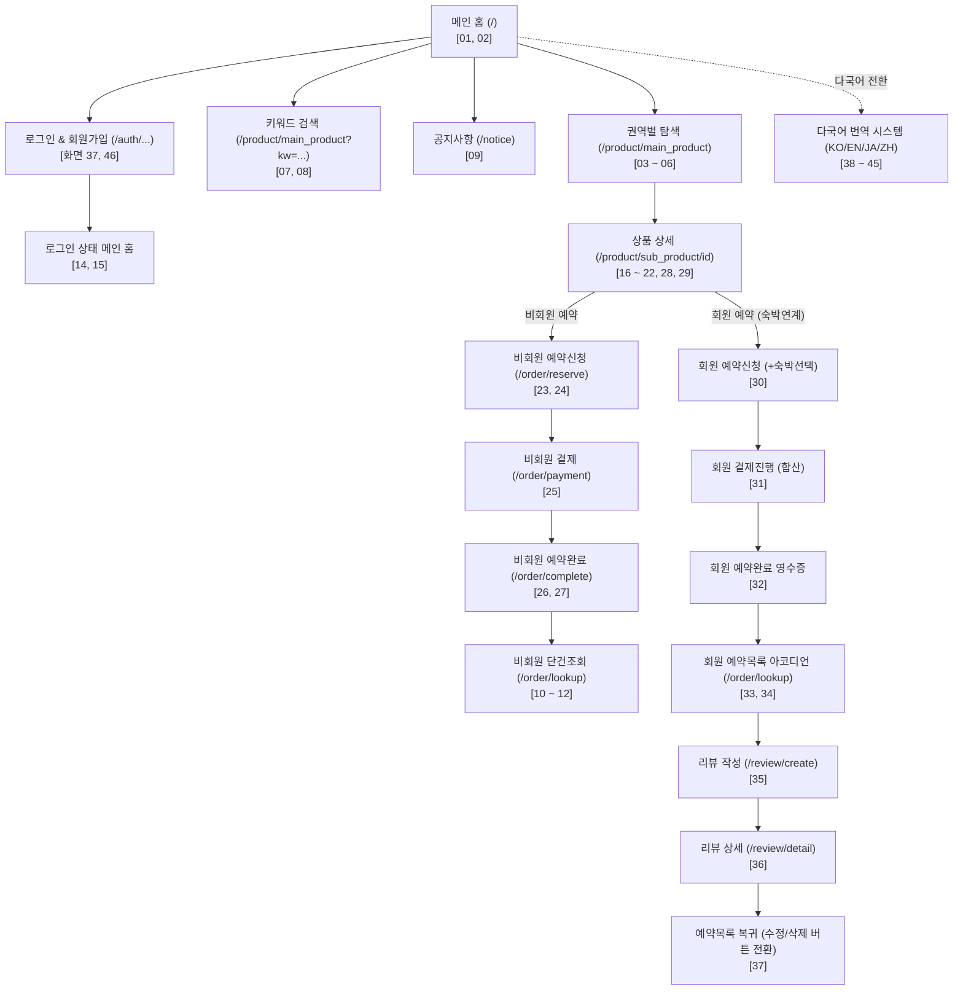

# 🖥 길마중 (Gilmajung Tour) 전체 화면별 기능 설명서
> **실제 구동 화면(캡처 이미지 46종) 기반 View별 기능 및 사용자 여정 완전 해설서**  
> 본 문서는 [`screen/`](screen/) 디렉토리에 보관된 46장의 실제 캡처 화면을 예시로 활용하여, 길마중 프로젝트의 View(블루프린트)별 동작 원리, 사용자 인터랙션, 보안 정책, 다국어 처리 및 데이터 흐름을 상세하게 설명합니다.

---

## 📌 목차
1. [시스템 전체 흐름도 (User Journey)](#1-시스템-전체-흐름도-user-journey)
2. [메인 포털 및 공통 뷰 (`main_views.py`)](#2-메인-포털-및-공통-뷰-main_viewspy)
   - [화면 01: 메인 홈 - 비로그인 배너 및 6대 권역 퀵 버튼](#화면-01-메인-홈---비로그인-배너-및-6대-권역-퀵-버튼)
   - [화면 02: 메인 홈 - M타임딜 카운트다운 및 후기 블러/오버레이](#화면-02-메인-홈---m타임딜-카운트다운-및-후기-블러오버레이)
   - [화면 03: 공지사항 목록 및 카테고리 탭 필터링](#화면-03-공지사항-목록-및-카테고리-탭-필터링)
   - [화면 04: 로그인 후 메인 홈 화면 상단](#화면-04-로그인-후-메인-홈-화면-상단)
   - [화면 05: 로그인 후 메인 홈 - 후기 블러 해제 및 열람](#화면-05-로그인-후-메인-홈---후기-블러-해제-및-열람)
3. [여행 상품 및 권역 탐색 뷰 (`product_views.py`)](#3-여행-상품-및-권역-탐색-뷰-product_viewspy)
   - [화면 06: 수도권 상품 목록 상단 소개](#화면-06-수도권-상품-목록-상단-소개)
   - [화면 07: 수도권 Canvas 지도 인터랙션 및 상품 그리드](#화면-07-수도권-canvas-지도-인터랙션-및-상품-그리드)
   - [화면 08: 강원권 상품 목록 상단 소개](#화면-08-강원권-상품-목록-상단-소개)
   - [화면 09: 강원권 Canvas 지도 및 상품 그리드](#화면-09-강원권-canvas-지도-및-상품-그리드)
   - [화면 10: 헤더 통합 키워드 검색 결과 ('강릉')](#화면-10-헤더-통합-키워드-검색-결과-강릉)
   - [화면 11: 키워드 검색 결과 없음 안내 ('강구')](#화면-11-키워드-검색-결과-없음-안내-강구)
   - [화면 12: 상품 상세 - 고화질 갤러리 및 회원 할인가](#화면-12-상품-상세---고화질-갤러리-및-회원-할인가)
   - [화면 13: 상품 상세 - 상세 일정 타임라인 (오전 일정)](#화면-13-상품-상세---상세-일정-타임라인-오전-일정)
   - [화면 14: 상품 상세 - 상세 일정 타임라인 (향토 식사 안내)](#화면-14-상품-상세---상세-일정-타임라인-향토-식사-안내)
   - [화면 15: 상품 상세 - 지도 보기 (Google Maps)](#화면-15-상품-상세---지도-보기-google-maps)
   - [화면 16: 상품 상세 - 출발 전 정보 (포함/불포함 내역)](#화면-16-상품-상세---출발-전-정보-포함불포함-내역)
   - [화면 17: 상품 상세 - 집결지/준비사항 및 후기 목록](#화면-17-상품-상세---집결지준비사항-및-후기-목록)
   - [화면 18: 상품 상세 - 취소/환불 규정 및 인원 선택](#화면-18-상품-상세---취소환불-규정-및-인원-선택)
   - [화면 19: 회원 상품 추천(좋아요) 토글 전](#화면-19-회원-상품-추천좋아요-토글-전)
   - [화면 20: 회원 상품 추천(좋아요) 토글 완료](#화면-20-회원-상품-추천좋아요-토글-완료)
4. [주문, 결제 및 내역 조회 뷰 (`order_views.py`)](#4-주문-결제-및-내역-조회-뷰-order_viewspy)
   - [화면 21: 비회원 예약 신청 - 예약자 정보 입력](#화면-21-비회원-예약-신청---예약자-정보-입력)
   - [화면 22: 비회원 예약 신청 - 동행자 명단 및 약관 동의](#화면-22-비회원-예약-신청---동행자-명단-및-약관-동의)
   - [화면 23: 비회원 주문 결제 진행 (PortOne 연동)](#화면-23-비회원-주문-결제-진행-portone-연동)
   - [화면 24: 비회원 예약 및 결제 완료 영수증 카드](#화면-24-비회원-예약-및-결제-완료-영수증-카드)
   - [화면 25: 비회원 예약 완료 하단 - 인근 추천 및 리뷰 로그인 안내](#화면-25-비회원-예약-완료-하단---인근-추천-및-리뷰-로그인-안내)
   - [화면 26: 비회원 단건 예약 조회 폼](#화면-26-비회원-단건-예약-조회-폼)
   - [화면 27: 비회원 예약 상세 내역 카드 (상단)](#화면-27-비회원-예약-상세-내역-카드-상단)
   - [화면 28: 비회원 예약 상세 카드 (결제 및 약관 내역)](#화면-28-비회원-예약-상세-카드-결제-및-약관-내역)
   - [화면 29: 회원 전용 연계 숙박 시설(호텔/민박) 선택](#화면-29-회원-전용-연계-숙박-시설호텔민박-선택)
   - [화면 30: 회원 주문 결제 - 투어 + 연계 숙박 합산 결제](#화면-30-회원-주문-결제---투어--연계-숙박-합산-결제)
   - [화면 31: 회원 예약 및 결제 완료 영수증](#화면-31-회원-예약-및-결제-완료-영수증)
   - [화면 32: 회원 예약 조회 - 완료 직후 단건 포커스 열람](#화면-32-회원-예약-조회---완료-직후-단건-포커스-열람)
   - [화면 33: 회원 전체 예약 내역 아코디언 목록](#화면-33-회원-전체-예약-내역-아코디언-목록)
   - [화면 34: 회원 예약 내역 - 후기 작성 완료 후 수정/삭제 전환](#화면-34-회원-예약-내역---후기-작성-완료-후-수정삭제-전환)
5. [여행 후기 라이프사이클 뷰 (`review_views.py`)](#5-여행-후기-라이프사이클-뷰-review_viewspy)
   - [화면 35: 회원 여행자 후기 작성 화면 (별점 및 소감)](#화면-35-회원-여행자-후기-작성-화면-별점-및-소감)
   - [화면 36: 후기 등록 완료 후 상품별 후기 상세 화면](#화면-36-후기-등록-완료-후-상품별-후기-상세-화면)
6. [회원 인증 뷰 (`auth_views.py`)](#6-회원-인증-뷰-auth_viewspy)
   - [화면 37: 회원 로그인 화면](#화면-37-회원-로그인-화면)
   - [화면 46: 회원가입 화면](#화면-46-회원가입-화면)
7. [다국어 자동 번역 및 커스텀 치환 시스템 (`translate.js`)](#7-다국어-자동-번역-및-커스텀-치환-시스템-translatejs)
   - [화면 38: 영어 번역 - 메인 홈 화면](#화면-38-영어-번역---메인-홈-화면)
   - [화면 39: 일본어 번역 - 메인 홈 화면](#화면-39-일본어-번역---메인-홈-화면)
   - [화면 40: 영어 번역 - 충청권 상품 목록](#화면-40-영어-번역---충청권-상품-목록)
   - [화면 41: 일본어 번역 - 충청권 상품 목록](#화면-41-일본어-번역---충청권-상품-목록)
   - [화면 42: 중국어 간체 번역 - 충청권 상품 목록](#화면-42-중국어-간체-번역---충청권-상품-목록)
   - [화면 43: 중국어 간체 번역 - 단양 패러글라이딩 상품 상세](#화면-43-중국어-간체-번역---단양-패러글라이딩-상품-상세)
   - [화면 44: 일본어 번역 - 단양 패러글라이딩 상품 상세](#화면-44-일본어-번역---단양-패러글라이딩-상품-상세)
   - [화면 45: 영어 번역 - 단양 패러글라이딩 상품 상세](#화면-45-영어-번역---단양-패러글라이딩-상품-상세)

---

## 1. 시스템 전체 흐름도 (User Journey)

---

## 2. 메인 포털 및 공통 뷰 (`main_views.py`)

### 화면 01: 메인 홈 - 비로그인 배너 및 6대 권역 퀵 버튼

- **캡처 파일**: `screen/01_메인_비로그인_홈배너및권역.png`
- **담당 라우트**: `main_views.index()` (`GET /`)
- **템플릿**: [`pybo/templates/index.html`](file:///d:/hongdonjoo/flask/project1/div-flask/pybo/templates/index.html), [`pybo/templates/main_fragments/_banner.html`](file:///d:/hongdonjoo/flask/project1/div-flask/pybo/templates/main_fragments/_banner.html)
- **주요 기능 및 특징**:
  - **헤더 GNB 통합 검색창**: `searchBoxWrap` 폼에서 키워드를 입력하고 Enter 또는 돋보기 버튼을 클릭하면 `product.main_product?kw=...`로 즉시 연결됩니다.
  - **비주얼 배너 슬라이더**: 계절감과 여행 감성을 담은 풀스크린 배너 캐러셀이 구동됩니다.
  - **6대 권역 원형 퀵 버튼**: 수도권, 강원, 충청, 경상, 전라, 제주 권역 아이콘이 원형으로 배치되어 클릭 시 해당 권역 상품 목록으로 즉시 이동합니다.
  - **비로그인 GNB 헤더**: 우측 상단에 '로그인', '후기', '예약확인', '고객센터', '한국어(언어선택기)'가 정돈되어 노출됩니다.

---

### 화면 02: 메인 홈 - M타임딜 카운트다운 및 후기 블러/오버레이

- **캡처 파일**: `screen/02_메인_비로그인_M타임딜및후기블러.png`
- **담당 라우트**: `main_views.index()` (`GET /`)
- **템플릿**: [`pybo/templates/main_fragments/_time_deal.html`](file:///d:/hongdonjoo/flask/project1/div-flask/pybo/templates/main_fragments/_time_deal.html), [`pybo/templates/main_fragments/_review.html`](file:///d:/hongdonjoo/flask/project1/div-flask/pybo/templates/main_fragments/_review.html)
- **주요 기능 및 특징**:
  - **M타임딜 실시간 초단위 카운트다운**: 메인 1건(특급호텔 1박 업그레이드 등)과 서브 2건으로 분할 전시되며, 자바스크립트 타이머가 남은 시간을 `D일 HH:MM:SS`로 실시간 갱신합니다.
  - **비로그인 여행자 후기 블러 보호 (`review-login-overlay`)**:
    - 비로그인 사용자가 접속할 경우 후기 카드 그리드에 `filter: blur(5px)` 스타일이 적용되어 내용을 무단으로 읽을 수 없습니다.
    - 블러 영역 중앙에 투명한 오버레이 박스와 **"User login시에 후기를 확인할 수 있습니다"** 안내 버튼이 표시되며, 클릭 시 로그인 페이지(`/auth/login/?next=/`)로 안전하게 이동합니다.

---

### 화면 03: 공지사항 목록 및 카테고리 탭 필터링

- **캡처 파일**: `screen/09_공지사항_목록및필터.png`
- **담당 라우트**: `main_views.notice_list()` (`GET /notice`)
- **템플릿**: [`pybo/templates/notice.html`](file:///d:/hongdonjoo/flask/project1/div-flask/pybo/templates/notice.html)
- **주요 기능 및 특징**:
  - **카테고리별 탭**: '전체', '시스템', '공모전', '투어안내', '이벤트', '안내' 탭을 원클릭으로 필터링합니다.
  - **키워드 검색**: 제목 및 본문 통합 검색창을 제공합니다.
  - **아코디언 본문 열람**: 각 공지사항 카드를 클릭하면 본문 내용이 부드럽게 펼쳐집니다. 메인 화면 공지 클릭 시 해당 공지가 속한 페이지 번호를 자동 계산하여 펼친 상태로 로드합니다.

---

### 화면 04: 로그인 후 메인 홈 화면 상단

- **캡처 파일**: `screen/14_메인_로그인후_홈배너및헤더.png`
- **담당 라우트**: `main_views.index()` (`GET /`)
- **주요 기능 및 특징**:
  - **인증 사용자 맞춤 헤더**: 로그인 완료 후 GNB 상단에 **"홍길동님 환영합니다"**, **"로그아웃"**, **"예약확인"** 메뉴가 활성화됩니다.
  - 세션 기반 인증 상태가 즉시 반영되어 맞춤형 서비스 이용이 가능합니다.

---

### 화면 05: 로그인 후 메인 홈 - 후기 블러 해제 및 열람

- **캡처 파일**: `screen/15_메인_로그인후_M타임딜및후기블러해제.png`
- **담당 라우트**: `main_views.index()` (`GET /`)
- **주요 기능 및 특징**:
  - **블러 및 오버레이 자동 해제**: `g.user` 인증이 확인되면 후기 목록의 블러 필터와 로그인 오버레이가 완전히 걷힙니다.
  - 실제 여행객들이 남긴 별점, 생생한 후기 요약, 여행지 태그를 깨끗한 UI로 자유롭게 탐색할 수 있습니다.

---

## 3. 여행 상품 및 권역 탐색 뷰 (`product_views.py`)

### 화면 06: 수도권 상품 목록 상단 소개

- **캡처 파일**: `screen/03_상품목록_수도권_상단소개.png`
- **담당 라우트**: `product_views.main_product()` (`GET /product/main_product?region=sudo`)
- **템플릿**: [`pybo/templates/product/main_product.html`](file:///d:/hongdonjoo/flask/project1/div-flask/pybo/templates/product/main_product.html)
- **주요 기능 및 특징**:
  - 수도권 탭 선택 시 테마 소개 헤더("트렌디한 도시 감성과 아늑한 휴식의 공존...")가 표시됩니다.

---

### 화면 07: 수도권 Canvas 지도 인터랙션 및 상품 그리드

- **캡처 파일**: `screen/04_상품목록_수도권_Canvas지도및상품그리드.png`
- **스크립트**: [`pybo/static/js/main_product.js`](file:///d:/hongdonjoo/flask/project1/div-flask/pybo/static/js/main_product.js)
- **주요 기능 및 세부 알고리즘**:
  - **HTML5 Canvas 픽셀 플러드필(Flood Fill)**:
    - `initMapCanvas()`가 로드 시 `buildRegionGrid()`를 1회 호출하여 `regionSeeds`로부터 4방향 큐 탐색으로 370×539 크기의 룩업 바이트 배열(`regionGrid`)을 사전 빌드.
    - 사용자가 지도 클릭 시 `getRegionFromCoord(clickX, clickY)`가 `regionGrid`를 O(1)로 조회하여 수도권 영역을 즉각 판별하고 `activateRegion('sudo')`를 호출.
  - **실시간 마우스 호버(Hover) 하이라이트**:
    - `mousemove` 이벤트 발생 시 `getRegionFromCoord(moveX, moveY)`로 마우스 아래 권역을 판별하고 커서를 `pointer`로 변경.
    - `renderMap(currentActiveRegion, hoveredRegion)`이 원본 픽셀 복사본에서 해당 권역 픽셀을 산뜻한 에메랄드 그린(`rgba(66, 186, 130, 0.76)`)으로 고속 교체하고 `drawRegionBadge()`로 권역 중심에 둥근 알약형 뱃지('📍 수도권') 렌더링.
  - **Sticky 고정 스크롤**: 스크롤을 내려도 좌측 Canvas 지도와 탭 메뉴가 상단에 고정(`position: sticky`)되어 언제든 다른 권역으로 전환 가능.
  - **우측 2열 반응형 그리드**: 가평 아침고요수목원 등 수도권 16개 테마 상품이 평점, 추천수, 가격과 함께 정렬됩니다.

---

### 화면 08 & 09: 강원권 상품 목록 전환 및 Canvas 지도

- **캡처 파일**: `screen/05_상품목록_강원권_상단소개.png`, `screen/06_상품목록_강원권_Canvas지도및상품그리드.png`
- **담당 라우트**: `product_views.main_product()` (`GET /product/main_product?region=gang`)
- **주요 기능 및 특징**:
  - 지도 또는 탭에서 '강원권' 클릭 시, 페이지 전체 리로드 없이 URL 파라미터가 갱신되며 강원 권역 테마 소개와 대관령, 강릉, 속초 등 강원도 투어 패키지 16종으로 즉각 동기화됩니다.

---

### 화면 10 & 11: 헤더 통합 키워드 검색 결과 연동 ('강릉' vs '강구')

- **캡처 파일**: `screen/07_상품목록_키워드검색_강릉결과.png`, `screen/08_상품목록_키워드검색_결과없음안내.png`
- **주요 기능 및 특징**:
  - **성공 검색 ('강릉')**: `TourProduct.name.ilike('%강릉%')` 조건으로 필터링되어 `🔍 '강릉' 검색 결과 (총 7건)` 배너와 함께 일치 상품만 정렬 출력됩니다.
  - **결과 없음 ('강구')**: 일치하는 여행 상품이 없을 경우 `검색 결과가 없습니다` 안내 메시지와 함께 원클릭 `[검색 초기화]` 버튼을 제공하여 UX를 보호합니다.

---

### 화면 12 ~ 18: 상품 상세 및 일정 안내 (가평 남이섬 & 대관령)

- **캡처 파일**: `screen/16_...` ~ `screen/22_...`
- **담당 라우트**: `product_views.sub_product(product_id)` (`GET /product/sub_product/<int:product_id>`)
- **템플릿**: [`pybo/templates/product/sub_product.html`](file:///d:/hongdonjoo/flask/project1/div-flask/pybo/templates/product/sub_product.html)
- **주요 기능 및 세부 탭 구성**:
  1. **고화질 멀티 갤러리 (화면 16)**: Swiper.js 기반 4장 고화질 사진 갤러리와 섬네일 슬라이더. 정상가(65,000원) 대비 회원 로그인 15% 할인가(55,250원) 표시.
  2. **상세 일정 타임라인 (화면 17, 18)**: 08:00 서울 출발 ➔ 09:40 수목원 산책 ➔ 12:30 가평 잣 닭갈비 식사 ➔ 14:10 남이섬 유람선 입도 등 단계별 일정 카드.
  3. **지도 보기 (화면 19)**: 출발지와 핵심 관광지 동선을 Google Maps 위젯으로 직관적 표시.
  4. **출발 전 정보 (화면 20, 21)**: 차량비/가이드비 포함 내역, 개인 경비 불포함 내역, 집결 장소(시청역/잠실역), 준비물 안내.
  5. **여행자 후기 섹션 (화면 21)**: 로그인 상태에서는 후기 전문을 열람할 수 있으며, 비로그인 시에는 오버레이로 보호됩니다.
  6. **취소/환불 규정 및 인원 선택 (화면 22)**: 3일 전 100% 전액 환불 규정 명시, 동행 인원 선택 및 예약하기 버튼 제공.

---

### 화면 19 & 20: 회원 상품 추천(좋아요) 실시간 토글

- **캡처 파일**: `screen/28_상품상세_회원_가평남이섬_추천토글전.png`, `screen/29_상품상세_회원_가평남이섬_추천완료토글.png`
- **담당 라우트**: `product_views.toggle_product_like()` (`POST /product/sub_product/like`)
- **스크립트**: [`pybo/static/js/sub_product.js`](file:///d:/hongdonjoo/flask/project1/div-flask/pybo/static/js/sub_product.js)
- **주요 기능 및 특징**:
  - 회원 로그인 상태에서 '추천하기' 버튼을 클릭하면 `ProductLike` ORM을 통해 1인 1회 추천이 등록됩니다.
  - 빈 하트(♡)가 빨간 채운 하트(❤️)로 변경되고 누적 추천수가 실시간 1 증가합니다.
  - 다시 클릭하면 추천이 취소되고 원래 숫자로 복원되는 토글 메커니즘을 지원합니다.
  - 비로그인 상태에서 클릭 시 `401 Unauthorized`를 감지하여 로그인 이동 컨펌 팝업을 띄웁니다.

---

## 4. 주문, 결제 및 내역 조회 뷰 (`order_views.py`)

### 화면 21 ~ 25: 비회원 예약 신청, 결제 및 완료 프로세스

- **캡처 파일**: `screen/23_...` ~ `screen/27_...`
- **담당 라우트**:
  - 예약 신청: `order_views.reserve()` (`GET/POST /order/reserve`)
  - 결제 진행: `order_views.payment()` (`GET/POST /order/payment`)
  - 예약 완료: `order_views.complete()` (`GET /order/complete`)
- **주요 기능 및 특징**:
  - **비회원 게스트 주문 (화면 23)**: 성명, 연락처, 이메일을 수기 입력하여 회원가입 없이도 편리하게 투어 예약 가능.
  - **동행 여행객 명단 & 약관 동의 (화면 24)**: 인원수에 맞춘 탑승객 명부 동적 폼 생성 및 4대 필수 약관 유효성 검사.
  - **PortOne 결제 진행 (화면 25)**: 최종 결제 금액 산출 및 신용/체크카드 결제 모의 승인.
  - **영수증 요약 (화면 26)**: 헤더 브랜드 마크(`.logo-mark`), 고유 주문번호(`ORD-...`), 결제 정보 요약 영수증 발급.
  - **인근 명소 추천 (화면 27)**: 동일 권역의 연관 명소 슬라이더와 함께, 비회원에게는 'Review 작성 (로그인 필요)' 안내 버튼 제공.

---

### 화면 26 ~ 28: 비회원 단건 예약 조회

- **캡처 파일**: `screen/10_...` ~ `screen/12_...`
- **담당 라우트**: `order_views.lookup()` (`GET/POST /order/lookup`)
- **템플릿**: [`pybo/templates/order/lookup.html`](file:///d:/hongdonjoo/flask/project1/div-flask/pybo/templates/order/lookup.html)
- **주요 기능 및 특징**:
  - **보안 검증 (화면 10)**: 비회원은 예약 시 기재한 **성함**과 발급된 **주문번호** 2가지가 모두 일치해야만 조회가 허용됩니다.
  - **상세 내역 확인 (화면 11, 12)**: 일치 시 접이식 카드 형태로 투어 상품, 인원, 동행인, 최종 결제 금액, PG 결제 식별자, 약관 동의 이력이 안전하게 노출됩니다.

---

### 화면 29 ~ 34: 회원 전용 연계 숙박 예약 & 전체 내역 관리

- **캡처 파일**: `screen/30_...` ~ `screen/34_...`, `screen/37_...`
- **주요 기능 및 특징**:
  - **회원 전용 연계 숙박 선택 (화면 30)**: 해당 권역의 추천 숙소(호텔 10개, 민박 10개) 목록을 열람하고 1박 연계 예약을 함께 선택 가능.
  - **통합 합산 결제 (화면 31)**: 투어 회원 할인가 + 연계 숙박 요금이 합산된 금액으로 실시간 결제 진행.
  - **통합 영수증 발급 (화면 32)**: 투어 일정과 숙소 예약이 한 번에 묶인 전자 영수증 발급.
  - **단건 자동 포커스 (화면 33)**: 결제 완료 후 예약 확인으로 이동 시 방금 주문한 카드가 자동으로 펼쳐짐.
  - **전체 예약 목록 아코디언 (화면 34)**: 홍길동 회원의 모든 예약 건을 접이식 카드로 확인하며 상태 배지 및 후기 버튼 제공.
  - **라이프사이클 버튼 전환 (화면 37)**: 후기를 작성한 예약 건은 'Review 작성' 버튼이 자동으로 **'✏️ Review 수정'** 및 **'🗑️ Review 삭제'** 버튼으로 전환되어 원클릭 관리 지원.

---

## 5. 여행 후기 라이프사이클 뷰 (`review_views.py`)

### 화면 35 & 36: 후기 작성 및 등록 완료 상세 화면

- **캡처 파일**: `screen/35_여행후기_회원_별점및리뷰작성폼.png`, `screen/36_여행후기_회원_후기등록완료및수정삭제버튼.png`
- **담당 라우트**:
  - 후기 작성: `review_views.create()` (`GET/POST /review/create/<int:product_id>`)
  - 후기 상세: `review_views.detail()` (`GET /review/detail/<int:product_id>`)
- **템플릿**: [`pybo/templates/review/review_form.html`](file:///d:/hongdonjoo/flask/project1/div-flask/pybo/templates/review/review_form.html), [`pybo/templates/review/review_detail.html`](file:///d:/hongdonjoo/flask/project1/div-flask/pybo/templates/review/review_detail.html)
- **주요 기능 및 특징**:
  - **엄격한 실구매자 권한 검증 (화면 35)**: 취소되지 않은 유효한 주문을 완료한 로그인 회원만 후기 작성이 가능하며, 별점(★1~5)과 솔직한 소감을 작성합니다.
  - **등록 완료 및 관리 버튼 (화면 36)**: 등록 즉시 상품 후기 상세로 이동하며, 상단 알림 배너 및 본인이 작성한 후기 카드에 '수정' 및 '삭제' 버튼이 활성화되어 자유로운 관리를 보장합니다.

---

## 6. 회원 인증 뷰 (`auth_views.py`)

### 화면 37: 회원 로그인 화면

- **캡처 파일**: `screen/13_회원인증_로그인화면.png`
- **담당 라우트**: `auth_views.login()` (`GET/POST /auth/login`)
- **템플릿**: [`pybo/templates/auth/login.html`](file:///d:/hongdonjoo/flask/project1/div-flask/pybo/templates/auth/login.html)
- **주요 기능 및 특징**:
  - 아이디, 비밀번호 입력 및 `pbkdf2:sha256` 해시 인증.
  - 작업 중이던 이전 URL로의 안전한 리다이렉트(`?next=...`) 지원.
  - 카카오 OAuth 2.0 간편 로그인 버튼 연동.

---

### 화면 46: 회원가입 화면

- **캡처 파일**: `screen/46_회원가입.png`
- **담당 라우트**: `auth_views.signup()` (`GET/POST /auth/signup`)
- **템플릿**: [`pybo/templates/auth/signup.html`](file:///d:/hongdonjoo/flask/project1/div-flask/pybo/templates/auth/signup.html)
- **주요 기능 및 특징**:
  - **신규 회원 가입 우대 혜택 배너**: "전 상품 10~20% 특별 할인 및 추천 숙소 연계 예약" 회원 전용 혜택을 시각적으로 안내하여 가입 동기 부여.
  - **입력 양식 및 유효성 검증 필드**:
    - **로그인 아이디 (4~25자)**: 아이디 형식 검증 및 비동기/실시간 `[중복확인]` 기능 제공.
    - **실명 또는 사용자 이름**: 주문 및 탑승객 대표자 연동을 위한 실명 입력.
    - **이메일 주소**: 예약 확인서 및 영수증 발송용 고유 이메일 형식 검증 및 중복 체크.
    - **휴대폰 번호**: 비상 연락 및 알림 수신을 위한 연락처(`010-1234-5678`) 검증.
    - **비밀번호 & 비밀번호 확인**: 영문/숫자 조합 보안 비밀번호 일치 검사 및 `pbkdf2:sha256` 암호화 해싱 저장.
  - **가입 완료 후 처리**: 가입 완료 시 로그인 페이지로 자동 이동하며, 작업 중이던 이전 페이지 경로(`?next=...`)를 유지하여 가입 후 연속적인 예약 및 서비스 이용을 원활하게 지원.

---

## 7. 다국어 자동 번역 및 커스텀 치환 시스템 (`translate.js`)

본 프로젝트는 Google Translate 위젯과 자체 프론트엔드 치환 엔진([`pybo/static/js/translate.js`](file:///d:/hongdonjoo/flask/project1/div-flask/pybo/static/js/translate.js))을 결합하여 한국어, 영어, 일본어, 중국어 4개 국어를 왜곡 없이 완벽하게 지원합니다.

### 1) 메인 홈 다국어 화면 비교 (화면 38, 39)
| 영어 번역 (`en`) | 일본어 번역 (`ja`) |
| :---: | :---: |
|  |  |
| **`screen/38_다국어_영어_메인홈.png`** | **`screen/39_다국어_일본어_메인홈.png`** |
- **영어**: GNB와 타이틀이 `Welcome`, `log out`, `Metropolitan`, `Jeju Udo Electric Vehicle Tour`로 깔끔하게 렌더링.
- **일본어**: `吉馬中`, `日本語`, `済州島`, `全羅圏`, `首都圏` 등으로 자연스럽게 전환.

---

### 2) 충청권 상품 목록 3개 국어 번역 비교 (화면 40, 41, 42)
| 영어 (`en`) | 일본어 (`ja`) | 중국어 간체 (`zh-CN`) |
| :---: | :---: | :---: |
|  |  |  |
| `screen/40_...` | `screen/41_...` | `screen/42_...` |
- **특징**: `region=chung` 파라미터와 Sticky 지도가 유지되면서 우측 투어 상품명, 평점, 테마 문구가 해당 국가 언어로 완벽히 번역됩니다.

---

### 3) 단양 패러글라이딩 상품 상세 3개 국어 번역 비교 (화면 43, 44, 45)
| 중국어 간체 (`zh-CN`) | 일본어 (`ja`) | 영어 (`en`) |
| :---: | :---: | :---: |
|  |  |  |
| `screen/43_...` | `screen/44_...` | `screen/45_...` |
- **특징**:
  - 상세 일정, 하이라이트, 포함/불포함 내역 및 '추천하기' 버튼 텍스트까지 각 언어에 맞게 실시간 번역 적용.
  - 레이아웃을 깨뜨리는 긴 번역어(예: '수도권'의 `metropolitan area`)를 **`metropolitan`** 으로 강제 치환하는 `TreeWalker` 및 `MutationObserver` 엔진이 백그라운드에서 실시간 동작하여 디자인 무결성을 유지합니다.

---

## 8. 요약 및 결론

이로써 길마중 플랫폼은 **메인 포털 탐색 ➔ 권역별 Canvas 대화형 지도 ➔ 상품 상세 및 일정 ➔ 회원/비회원 예약 및 결제 ➔ 영수증 발급 ➔ 예약 조회 ➔ 실구매자 후기 라이프사이클(작성·수정·삭제) ➔ 실시간 4개 국어 번역**에 이르는 전체 사용자 여정을 매끄럽고 안정적인 인터랙션으로 완벽히 제공합니다.

